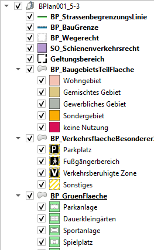
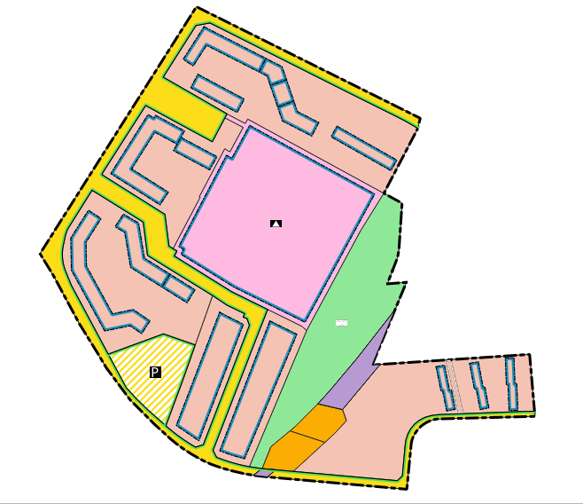

# SAGis XPlanung

SAGis XPlanung ist eine Erweiterung für die GIS-Software QGIS zur [XPlanung](https://www.xleitstelle.de/xplanung/ueber_xplanung) - konformen 
Erfassung von Flächennutzungsplänen, Bebauungsplänen und Raumordnungsplänen. 

## Funktionen

- Digitale Erfassung von Planwerken der Bauleitplanung (teil- und vollvektorielle Erfassungsstrategie)
- Persistentes Speichern der Planinhalte in einer Datenbank
- Verknüpfung der räumlichen Planinhalte mit externen Referenzen
- Export des Austauschformats _XPlanGML_ (Version 5.3 und 6.0)
- Import von _XPlanGML_-Dokumenten 
- Visualisierung der räumlichen Informationen von Planwerken auf dem QGIS-Kartencanvas

> [!NOTE]  
> Die hier bereitgestellte Version besitzt nicht den vollen Funktionsumfang. Bitte beachten Sie die folgende Tabelle zur Gegenüberstellung der Versionen.

|                                                             | Community-Version   | Vollversion        |
|-------------------------------------------------------------|---------------------|--------------------|
| Teilvektorielle Erfassung                                   | :heavy_check_mark:  | :heavy_check_mark: |
| Speichern externer Referenzen                               | :heavy_check_mark:  | :heavy_check_mark: |
| Import von XPlanGML-Dokumenten                              | :heavy_check_mark:  | :heavy_check_mark: |
| Visualisierung gemäß PlanZV                                 | :heavy_check_mark:  | :heavy_check_mark: |
| Export von XPlanGML-Dokumenten                              | [^abbr1]            | :heavy_check_mark: |
| Bearbeiten von XPlanung-Attributen                          | [^abbr1]            | :heavy_check_mark: |
| Erfassung neuer Planinhalte <br/>(vollvektorielle Erfassung) |                     | :heavy_check_mark: |
| Codelist-Attribute                                           |                    | :heavy_check_mark: |
| Benutzerdefinierte Symbolisierung                           |                     | :heavy_check_mark: |
| Tabellen-Import (Excel)                                   |                     | :heavy_check_mark: |
[^abbr1]: Nur für Basisobjekte möglich (teilvektorielle Erfassung)


## Nutzung
    
### Software-Vorraussetzungen

- QGIS >= 3.22
- PostgreSQL >= 12 mit PostGIS 3.1

### Installation 

SAGis XPlanung kann über das QGIS-Plugin Repository heruntergeladen werden.

Für eine erfolgreiche Ausführung des Programms müssen zudem folgende Python-Komponenten installiert werden:
- lxml
- packaging
- SQLAlchemy==1.4.49 (:warning: Anwendung nicht kompatibel mit SQLAlchemy 2.0)
- GeoAlchemy2==0.12.5
- shapely>=2.0.2
- qasync==0.22.0
- asyncpg==0.29.0

<details><summary><b>Anleitung anzeigen</b></summary>

#### Automatische Installation 
Beim Start des Plugins werden alle Python-Komponenten geprüft.
Sollten bestimmte Pakete fehlen, oder in einer falschen Version vorliegen, können die 
Module über einen Dialog im QGIS geladen werden.

> [!WARNING]  
> Wenn keine Berechtigung zum Schreiben im QGIS/Python-Installationsverzeichnis vorliegt, kann die 
automatische Installation scheitern. Siehe [Installation über OSGeo4W-Kommandozeile](#installation-über-osgeo4w-kommandozeile), 
um die benötigten Python-Module zu laden.

#### Installation über OSGeo4W-Kommandozeile
1. Suchen Sie das Installationsverzeichnis von QGIS (Zumeist `C:\OSGeo4W\` oder `C:\Program Files\QGIS 3.*'`)

2. Im Verzeichnis befindet sich die _OSGeo4W-Shell_ (Datei mit dem Namen `OSGeo4W.bat`). Starten Sie die _OSGeo4W-Shell_ (mit Administrator-Rechten, falls keine Berechtigung zum Schreiben im Verzeichnis besteht) und führen Sie den folgenden Befehl im sich öffnenden Programm aus:

    ```sh
    o4w_env & python3 -m pip install lxml packaging sqlalchemy==1.4.49 GeoAlchemy2 shapely qasync asyncpg
    ```

</details>

### Beispieldaten

> [!NOTE]  
> Zum Testen stellt die [Leitstelle XPlanung/XBau](https://xleitstelle.de) im folgenden Repository Testdaten im XPlanGML-Format zur Verfügung: https://gitlab.opencode.de/xleitstelle/xplanung/testdaten

<details><summary><b>Visualisierung Beispielplan mit SAGis XPlanung</b></summary>
<div>
   
  
</div>
</details>

### Kontakt

- Mail: qgis-de@nti.biz
- Web: https://nti-group.com/de
---

<sup>
Copyright (C) 2023 NTI Deutschland GmbH
</sup></br>
<sup>
This program is free software: you can redistribute it and/or modify
it under the terms of the GNU General Public License as published by
the Free Software Foundation, either version 3 of the License, or
(at your option) any later version.
</sup>
<sup>
This program is distributed in the hope that it will be useful,
but WITHOUT ANY WARRANTY; without even the implied warranty of
MERCHANTABILITY or FITNESS FOR A PARTICULAR PURPOSE.  See the
GNU General Public License for more details.
</sup>
<sup>
You should have received a copy of the GNU General Public License
along with this program.  If not, see https://www.gnu.org/licenses/.
</sup>

