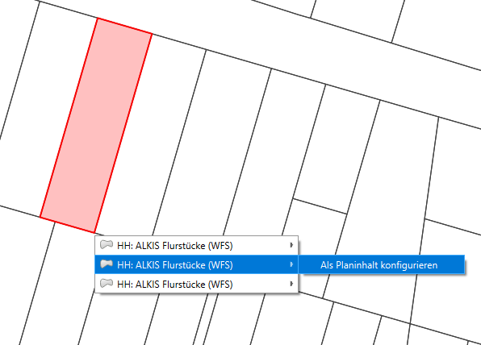
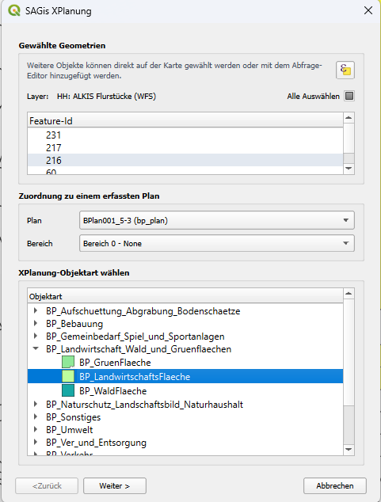
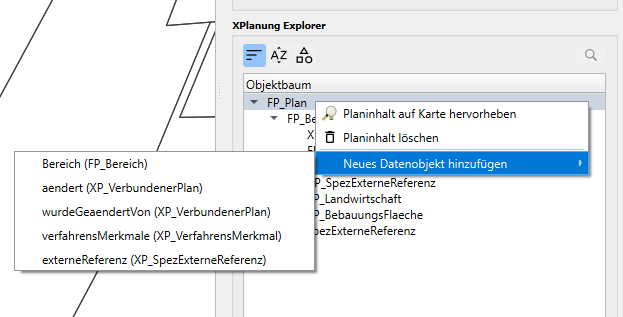

# Konfiguration von Planinhalten

Nach dem [Erfassen eines Planwerks](new-plan.md), können sowohl vektorielle Planinhalte 
zugeordnet werden als auch Planinhalte, die keine Geometrien enthalten – 
die sogenannten Datenobjekte.

## Planinhalte mit Raumbezug hinzufügen

Vollversion

Voraussetzung zum Hinzufügen vektorieller Planinhalte ist, dass ein Layer 
mit Objekten im QGIS geladen ist, der Geometrien für die neuen Planinhalte
enthält. Dies kann ein Layer aus beliebiger Datenquelle oder auch ein Temporärlayer sein.

!!! info 

    Um vektorielle Planinhalte einem Planwerk zuordnen zu können, muss bei der [Erfassung eines Planwerks](new-plan.md) mindestens ein Bereich angelegt werden. 
    Ein Bereich dient zur logischen Gruppierung von Planinhalten. Bereiche nachträglich hinzufügen, ist über die
    Funktion [Datenobjekte hinzufügen](#) möglich.

1. Das Werkzeug **Planinhalte konfigurieren / abfragen** aus der XPlanung-Werkzeugleiste wählen. ++alt+q++
2. Mit der rechten Maustaste ein Objekt auf der Karte wählen, das als neuer Planinhalt konfigurieren werden soll.
   Im Kontextmenü die Option **Als Planinhalt konfigurieren** wählen.

    <figure markdown="span">
        
    </figure>
   
3. Im folgenden Dialog findet die Zuordnung der gewählten Geometrien zu einem Planwerk statt. Dabei wird eine Objektart 
   aus dem XPlanung-Objektkatalog zugewiesen. Es bestehen folgende Optionen zum Konfigurieren eines neuen Planinhalts:

    <table>
        <tr>
            <th>Gewählte Geometrien</th>
            <td>Diese Sektion erlaubt es, weitere Geometrien auf der Karte anzuwählen, die ebenfalls als gleiche
                Objektart mit gleichen Sachdaten erfasst werden soll. Durch das Anwählen der Checkbox <b>Alle Auswählen</b>
                können alle Objekte im gewählten Layer markiert werden. Über das Abfrage-Symbol kann der Abfrageeditor 
                vom QGIS geöffnet werden. Dies ermöglicht das Auswählen von Objekten nach bestimmten Filter-Abfragen.
            </td>
        </tr>
        <tr>
            <th>Zuordnung zu einem Plan</th>
            <td>Auswahl eines Planwerks aus der Datenbank, zu dem die neu konfigurierten Planinhalte zugeordnet werden 
                sollen. 
            </td>
        </tr>
        <tr>
            <th>XPlanung-Objektart wählen</th>
            <td>Auswahl einer Objektart aus dem XPlanung-Schema, die den gewählten Geometrien zugeordnet werden.
                Die verfügbaren Objekte sind abgestimmt auf den Geometrietyp (Punkt, Linie, Polygon) des gewählten
                Layers und die Art des bei Sektion <b>Zuordnung zu einem Plan</b> gewählten Planwerks.
            </td>
        </tr>
    </table>
    !!! info
      
        Die Option <b>Alle Auswählen</b> funktioniert nur bei Layern mit weniger als 1000 Objekten.
        Für größere Layer muss zunächst ein Ausschnitt erstellt werden (Objekte mit QGIS Werkzeugen wählen, 
        dann mit Funktion <b>gewählte Objekte exportieren</b> neu speichern)

    <figure markdown="span">
        
    </figure>
    
4. Mit dem Button <b>Weiter</b> in das Sachdaten-Formular der gewählten Objektart wechseln
5. Nach Eingabe der Sachdaten für die neu zu erstellenden Objekte, mit dem Button <b>Speichern</b> 
   den Dialog bestätigen

Nach Bestätigen des Dialogs werden die neuen Objekte in der Datenbank angelegt und mit dem gewählten Plan verknüpft.
Neue Objekte erscheinen im Anschluss im Objektbaum.

## Datenobjekte hinzufügen

Datenobjekte sind Objektarten, die zusätzliche Sachdaten enthalten. Sie sind besitzen grundsätzliche keinen Raumbezug (Geometrie).
!!! warning 

    Ausnahme: Bereiche hinzufügen!
    Bereiche sind keine Datenobjekte, werden aber über die gleiche Funktion erstellt.

1. Planwerk wählen und <b>Planwerk Details</b> aufrufen
2. Im Objektbaum mit der rechten Maustaste das Kontextmenü eines Objekts öffnen und im Kontextmenü die Option 
    <b>Neues Datenobjekt hinzufügen</b> wählen:
    <figure markdown="span">
        
    </figure>

3. Im folgenden Dialog können die Sachdaten für eine gewählte Objektart eingetragen werden
4. Mit dem Button <b>Speichern</b> das Erfassen eines neuen Datenobjekt bestätigen

   