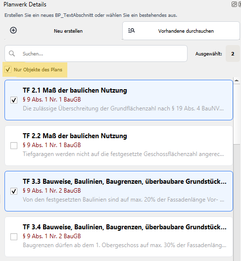
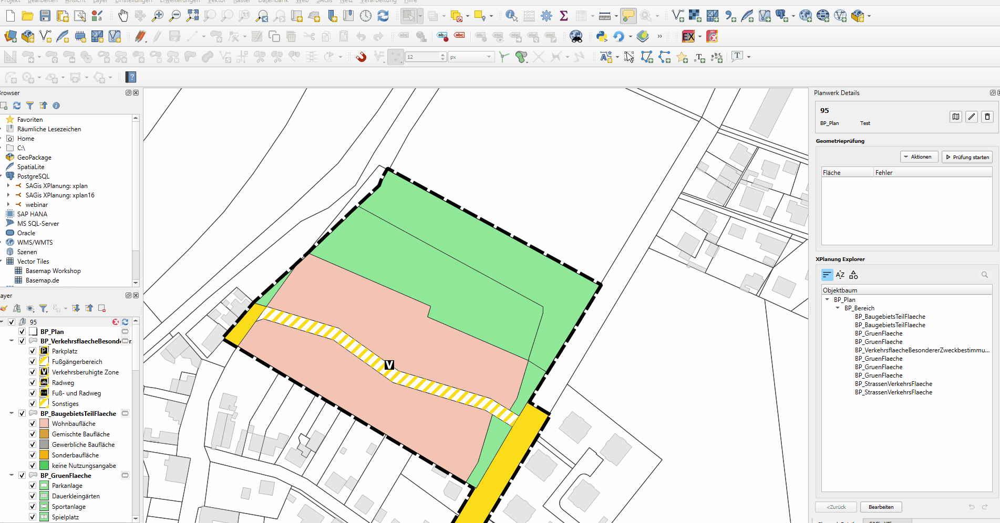
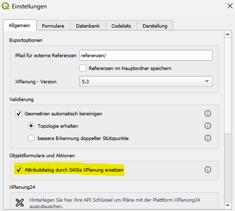
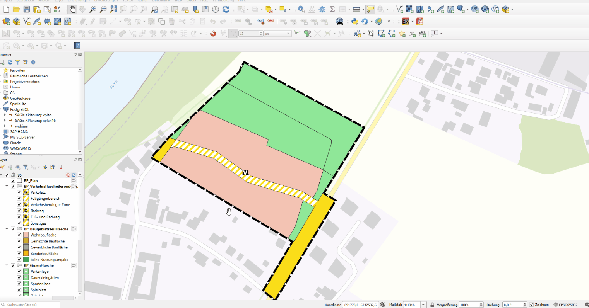

# Version 2.14.0
_Release vom 19.05.2026_

## Unterstützung weiterer Objektklassen aus dem XPlanung-Datenmodell

Mit Version 2.14.0 wurden mehr als 40 zusätzliche Objektklassen aus dem XPlanung-Datenmodell integriert. Dadurch können weitere Fachobjekte direkt innerhalb der Anwendung erfasst, bearbeitet und visualisiert werden.
Die Erweiterung verbessert insbesondere die Kompatibilität mit bestehenden XPlanGML-Datenbeständen und ermöglicht eine umfassendere Bearbeitung komplexer Planwerke.

---

## Filterfunktion beim Zuweisen von Textabschnitten

Bei der Auswahl und Verknüpfung von TextAbschnitten steht nun zusätzlich zur Suchfunktion auch eine 
Filtermöglichkeit zur Verfügung. Mit der Filter-Option _Nur Objekte des Plans_ werden nur TextAbschnitte zur Auswahl 
angezeigt, die bereits in diesem Plandokument an anderer Stelle verwendet werden.
Die neue Funktion erleichtert insbesondere die Arbeit in umfangreichen Projekten mit vielen textlichen Festsetzungen 
und verbessert die Übersichtlichkeit bei der Auswahl der Objekte in XPlanung-Relationen mit Kardinalität _m:n_.

---

## Löschen von XPlan-Objekten über das native QGIS-Werkzeug

XPlan-Objekte können nun direkt über das native QGIS-Werkzeug [**Ausgewähltes Löschen**](https://docs.qgis.org/3.44/de/docs/user_manual/working_with_vector/editing_geometry_attributes.html#deleting-selected-features) 
entfernt werden. Dadurch integriert sich die Bearbeitung von XPlan-Daten noch stärker in die gewohnte Arbeitsweise 
innerhalb von QGIS und ermöglicht ein konsistenteres Arbeiten direkt in der Kartenansicht.

Mit der neuen Funktion lassen sich zudem mehrere Objekte gleichzeitig löschen. Dies war bislang ausschließlich über die 
Auswahl im [Objektbaum](../elements/plan-details.md#der-objektbaum) möglich. Im Zuge dieser Erweiterung wurde außerdem die Unterstützung für das Rückgängigmachen von 
Löschvorgängen verbessert. Auch das gleichzeitige Löschen mehrerer Objekte kann nun über die Undo-/Redo-Funktion 
wiederhergestellt werden.

{ class="on-glb" }

---

## Option zum automatischen Öffnen der SAGis-Attributansicht

In den [Einstellungen](../settings/general.md#objektformulare-und-aktionen) kann nun optional festgelegt werden, dass bei der Objektabfrage automatisch die 
SAGis-Attributansicht anstelle des standardmäßigen QGIS-Objektformulars geöffnet wird. 

<figure markdown="span" style="height: 400px;">
    {: class="on-glb"; style="width: 100%; height: auto;" }
</figure>

<figure markdown="span" style="height: 400px;">
    {: class="on-glb"; style="width: 100%; height: 100%; object-fit: cover; object-position: 70% center;" }
</figure>

---

## Stilistische Verbesserungen verschiedener Objektklassen

Die Darstellung mehrerer Objektklassen wurde überarbeitet und visuell verbessert. Dies betrifft unter anderem:

- `SO_Strassenverkehr` (korrekte Unterscheidung `hatDarstellungMitBesondZweckbest`)
- `BP_Wegerecht` (korrekte Unterscheidung `istSchmal`)
- `FP_KeineZentrAbwasserBeseitigungFlaeche` (fehlender Stil nach PlanZV 15.1)

---

Alle weiteren Änderungen und Fehlerbehebungen:

[:material-github: Zum Changelog ](https://github.com/nti-de/SAGisXPlanung/blob/ce/CHANGELOG.md){ .md-button }