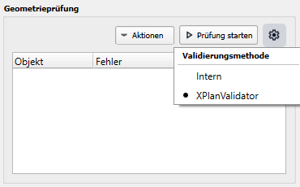
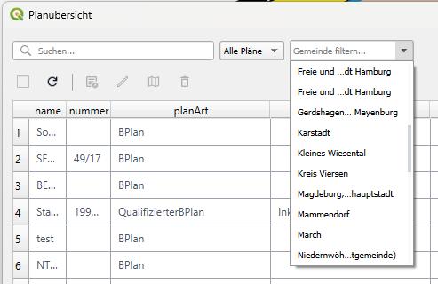
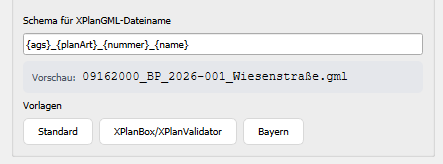
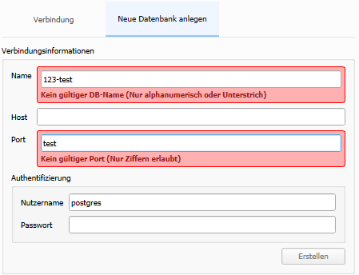

# Version 2.14.1
_Release vom 23.06.2026_

## Geometrievalidierung optional mit XPlanValidator

Die [Geometrievalidierung](../elements/plan-details.md#validierungsmethode) kann nun optional über die 
XPlanValidator-API ausgeführt werden. Damit steht neben der bisherigen lokalen Prüfung eine weitere Methode zur 
Verfügung, um Planinhalte gegen die XPlan-Validierungsregeln zu prüfen.

---

## Planübersicht nach Gemeinde filtern

In der Planübersicht gibt es jetzt eine zusätzliche [Filtermöglichkeit](../elements/plan-overview.md#suchen-sortieren-und-filtern)
nach Gemeinde. Dadurch lassen sich relevante Pläne in großen Datenbeständen deutlich schneller eingrenzen.

Zusammen mit einer kleineren Verbesserung bei den Suchergebnissen ist die Navigation in umfangreichen Datenbanken
jetzt übersichtlicher.

---

## Flexiblere Dateibenennung beim Export

Die Benennung von Exportdateien wurde erweitert. Für XPlanGML steht jetzt eine UI-gestützte Konfiguration des 
Dateinamens zur Verfügung, inklusive vollständigem Resolver für Platzhalter. Die Konfiguration des Dateinamens kann in 
den Einstellungen unter der Kategorie [Exportoptionen](../settings/general.md#exportoptionen) eingestellt werden.

---

## Überarbeitete Einstellungen und Datenbank-Setup

Die Architektur des Einstellungsdialogs wurde modularisiert und auf zukünftige Erweiterungen ausgerichtet. 
Damit ist das Speichern von Einstellungen beim Schließen des Dialogs nun wesentlich schneller.

Gleichzeitig wurde die Benutzerführung beim [Einrichten der Datenbank](../settings/database.md) verbessert und bessere Hinweise bei fehlerhaften 
Eingaben eingeführt.

---

Alle weiteren Änderungen und Fehlerbehebungen:

[:material-github: Zum Changelog ](https://github.com/nti-de/SAGisXPlanung/blob/ce/CHANGELOG.md){ .md-button }
