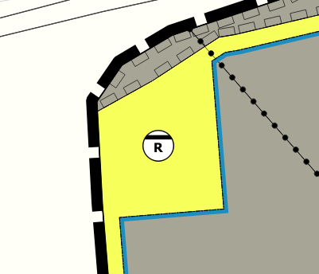
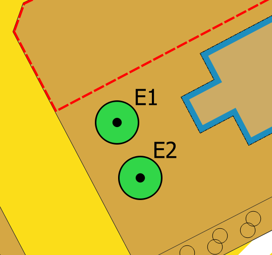

# Version 2.14.2
_Release vom 06.07.2026_

## Verbesserungen der Symbolisierung diverser Objektklassen

Die Darstellung der Objektklassen `BP_SchutzPflegeEntwicklungsFlaeche`,
`FP_SchutzPflegeEntwicklung` und `BP_VerEntsorgung` wurde überarbeitet.

Für die Versorgungsflächen steht jetzt ein eigenes Symbol für die Zweckbestimmung
*Regenwasser* zur Verfügung.

Der Style für `BP_KennzeichnungsFlaeche` wurde überarbeitet. Zusätzlich steht
nun auch für die Objektklasse `BP_Immissionsschutz` ein eigenes Stylesheet zur
Verfügung.

Zusätzlich wurde ein defektes SVG-Symbol für Fußgängerbereiche korrigiert.

{ style="height:200px;" }

---

## Präsentationsobjekte für alle Geometrietypen

Präsentationsobjekte (Text- und Symbolannotationen) können jetzt nicht mehr nur
für flächenhafte Planinhalte, sondern auch für Linien- und Punktgeometrien erstellt
werden. Die Position wird dabei automatisch auf den Mittelpunkt (Zentroid) der
Geometrie gesetzt, kann aber weiterhin auch beliebig angepasst werden.

{ style="height:200px;" }

---

Alle weiteren Änderungen und Fehlerbehebungen:

[:material-github: Zum Changelog ](https://github.com/nti-de/SAGisXPlanung/blob/ce/CHANGELOG.md){ .md-button }
