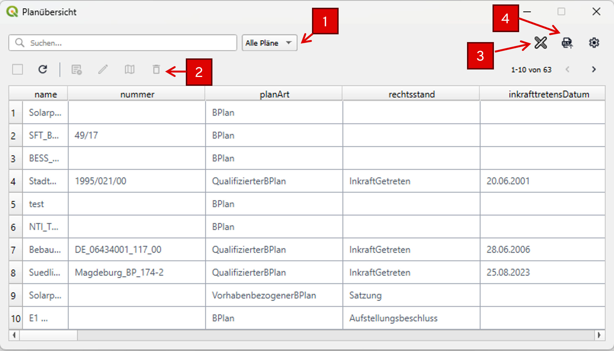
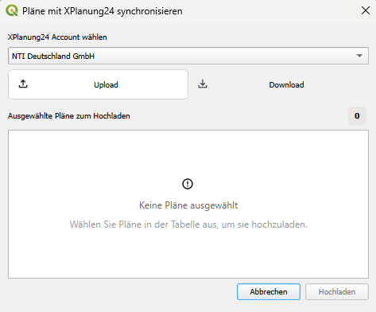
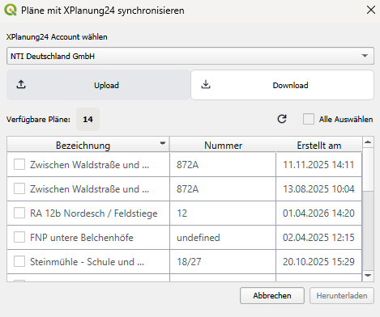

# Planübersicht

Die Planübersicht, gibt einen Überblick auf alle in der Datenbank gespeicherten Pläne in tabellarischer Form.
Weitere Aktionen im Dialog der Planübersicht:

1. [Suchen, Sortieren und Filtern](#suchen-sortieren-und-filtern)
2. [Planwerk-Aktionen](#planwerk-aktionen)
3. [Austausch mit XPlanung24](#austausch-mit-xplanung24)
4. [Tabellenimport](#)

    <h4>Planübersicht öffnen</h4>
    <ol>
        <li>
            [Hauptdialog](main-dialog.md) der Anwendung aufrufen
        </li>
        <li>
            Mit der Schaltfläche <b>ALLE ANZEIGEN</b> oberhalb der Planwerk-Auswahl wird die Planübersicht aufgerufen
        </li>
    </ol>
    

## Suchen, Sortieren und Filtern

- **Suche**: Im Suchfeld einen Suchbegriff eingeben und mit ++enter++ bestätigen
- **Filtern**: Zum Filtern kann in der Auswahlliste neben dem Suchfeld eine Auswahl der Planart getroffen werden.
- **Sortieren**: Die Sortierung der Einträge in der Tabelle kann durch Klicken in den Tabellenkopf in einer beliebigen Spalte beeinflusst werden

## Planwerk-Aktionen

Die Aktionsleiste unterhalb des Suchfelds bietet als Shortcuts den Zugriff auf einige Funktionen, die sich ebenfalls über die 
[Detailansicht eines Planwerks](plan-details.md) aufrufen lassen.

<table>
    <tr>
        <th>Allgemeine Aktionen</th>
        <td>
            <ul>
                <li><i>Alle wählen/abwählen</i>: Auswahl aller Einträge auf der aktuellen Seite</li>
                <li><i>Aktualisieren</i>: Manuelles Synchronisieren der Einträge mit den Inhalten der Datenbank</li>
            </ul>
        </td>
    </tr>
    <tr>
        <th>Planwerk-Aktionen</th>
        <td>
            Diese Gruppe an Aktionen betrefft die Auswahl in der Tabelle. Zum Wählen eines Eintrags an der entsprechenden
            Stelle in die Tabelle klicken. Nach Auswahl stehen folgende Aktionen zur Verfügung:
            <ul>
                <li><i>XPlanGML exportieren</i>: Gewählten Plan als XPlanGML-Datei exportieren</li>
                <li><i>Bearbeiten</i>: Öffnet den Dialog zum Bearbeiten der Sachdaten des gewählten Plans</li>
                <li><i>Kartenansicht</i>: Gewählten Plan auf der Karte anzeigen</li>
                <li><i>Löschen</i>: Gewählten Plan aus der Datenbank entfernen</li>
            </ul>
        </td>
    </tr>
</table>

## Austausch mit XPlanung24

Nach der Hinterlegung eines API-Schlüssels in den Einstellungen können Pläne direkt mit der Cloud-Plattform XPlanung24 ausgetauscht werden.

=== "Upload von Plänen"

    1. Gewünschte Pläne in der Planübersicht auswählen (Einzel- oder Mehrfachauswahl möglich)
    2. Den XPlanung24-Dialog öffnen
    3. Den gewünschten XPlanung24-Account aus der Dropdown-Liste auswählen
    4. Über den Button _Hochladen_ die ausgewählten Pläne in die Webplattform übertragen

    

=== "Download von Plänen"

    1. Den XPlanung24-Dialog öffnen
    2. Den gewünschten XPlanung24-Account aus der Dropdown-Liste auswählen
    3. Verfügbare Pläne zum Download auswählen (Einzel- oder Mehrfachauswahl möglich)
    4. Über den Button _Herunterladen_ die ausgewählten Pläne aus XPlanung24 abrufen und in die lokale XPlan-Datenbank übernehmen

    

## Navigationswerkzeuge

Standardmäßig werden in der Planübersicht 10 Pläne angezeigt. Um weitere Pläne zu laden, kann mit den Pfeilsymbolen zu 
weiteren Seiten navigiert werden, wenn mehr als die initial geladenen Pläne in der Datenbank gespeichert sind.

## Einstellungen

Über das Zahnradsymbol kann der Dialog _Planübersicht_ konfiguriert werden.
Im Abschnitt **Allgemein** besteht die Möglichkeit, die Anzahl der Pläne pro Seite festzulegen.
Im Abschnitt **Tabellenspalten anordnen** können einzelne Spalten ausgeblendet und per drag-and-drop die Anzeigereihenfolge
der XPlan-Attribute angepasst werden.