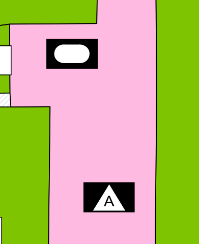
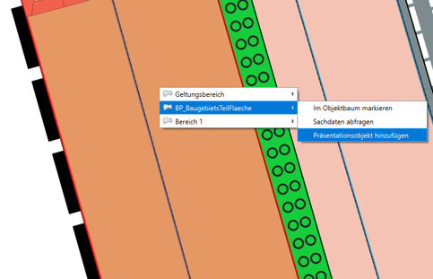
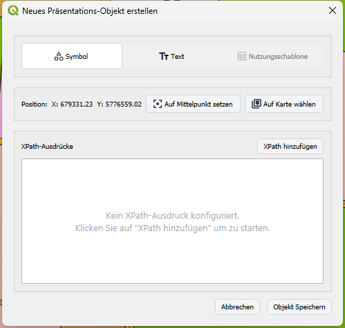
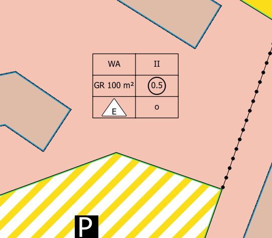
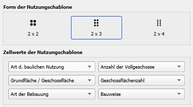

# Kartenanzeige

SAGis XPlanung enthält eine Sammlung an Standard-Darstellungsvorschriften zur Visualisierung von Planwerken nach 
den Vorlagen der Planzeichenverordnung. Eine Anpassung der individuellen Stile ist
in den [Einstellungen](settings/symbology.md) möglich.

!!! tip

    Die Darstellungskonfiguration aus den [Einstellungen](settings/symbology.md) wird auf alle Planwerke bei der 
    Kartenanzeige angewendet. Für die Anpassung der Darstellung einzelner Planwerke, können die üblichen QGIS-Darstellungseigenschaften
    projektbasiert verwendet werden. 


## Präsentationsobjekte

Zur Erweiterung der Darstellungsinformationen realisiert der Standard XPlanung das Konzept der Präsentationsobjekte.
Diese unterstützen oder ändern die Standard-Darstellung von Planinhalten, haben jedoch selbst keine fachliche Bedeutung.
Präsentationobjekte können graphische Annotationen, wie textliche Beschriftungen oder zusätzliche Symbole repräsentieren.

### Allgemein

In XPlanung werden Präsentationsobjekte für die grafische Darstellung im Plan verwendet, ohne selbst inhaltliche 
Planwerte zu repräsentieren. Man unterscheidet freie und gebundene Präsentationsobjekte. 

- Freie Präsentationsobjekte haben keinen Bezug zu einem Fachobjekt (z.B. ein bloßer Annotations-Text) und dienen nur 
der grafischen Beschriftung
- Gebundene Präsentationsobjekte sind über die Relation <code>&lt;xplan:dientZurDarstellungVon&gt;</code> mit genau einem 
Fachobjekt verknüpft und zeigen Attributwerte dieses Fachobjekts im Plan an

Bei gebundenen Präsentationsobjekten bestimmt das Attribut <code>&lt;xplan:art&gt;</code> den angezeigten Inhalt. 
In diesem Feld wird ein XPath-Ausdruck eingetragen, der auf ein oder mehrere Attribute des zugehörigen Fachobjekts referenziert. 
Der Ausdruck ist relativ zum Fachobjekt und verwendet in der Regel den Namensraum-Präfix <code>&lt;xplan:&gt;</code> vor jedem Elementnamen.
Praktisch wird also durch die Angabe <code>&lt;xplan:art&gt;xplan:text&lt;/xplan:art&gt;</code> angeben, den Inhalt des Attributs <i>text</i> zu visualisieren.

**Beispiel 1**: Darstellung von Einzelattributen 

```text
BP_Plan
├── BP_BaugebietsTeilFlaeche
│   ├── allgArtDerBaulNutzung: WohnBauflaeche
│   ├── besondereArtDerBaulNutzung: ReinesWohngebiet
│   └── XP_PPO
│       ├── art: {==xplan:allgArtDerBaulNutzung==}
│       └── art: {==xplan:besondereArtDerBaulNutzung==}
└── BP_GruenFlaeche
    ├── zweckbestimmung: Kleingarten
    └── XP_PPO
        └── art: {==xplan:zweckbestimmung==}
```
**Bedeutung**: Darstellung zweier punktförmiger Präsentationsobjekte:

<div class="grid" markdown>
<div markdown>
- Visualisierung der Inhalte aus Attributen *allgArtDerBaulNutzung* und *besondereArtDerBaulNutzung* auf einem Objekt `BP_BaugebietsTeilFlaeche`
</div>
<div markdown>
   - Visualisierung der Inhalte aus Attribut *zweckbestimmung* auf einem Objekt `BP_GruenFlaeche`
</div>
<figure markdown="span">
     {: style="width: 100%; height: 150px; background-size: cover;"}
 </figure>
 <figure markdown="span">
     {: style="width: 100%; height: 150px; background-size: cover;"}
 </figure>
</div>

**Beispiel 2**: Darstellung von Attributen mit Mehrfachauswahl

```text
FP_Plan
└── FP_Gemeinbedarf
    ├── zweckbestimmung: Sport, Schule
    ├── XP_PPO
    │   └── art: {==xplan:zweckbestimmung[1]==}
    └── XP_PPO
        └── art: {==xplan:zweckbestimmung[2]==}
```
**Bedeutung**: Darstellung von zwei punktförmigen Präsentationsobjekten auf einem einzelnen Fachobjekt aus der Mehrfachauswahl im Attribut *zweckbestimmung*

<figure markdown="span">
     {: style="width: 100%; height: 150px; background-size: cover;"}
</figure>

!!! warning "Index bei Mehrfachauswahl"
   
    Der Index im XPath-Ausdruck gibt an, welcher Wert bei Attributen mit Mehrfachauswahl visualisiert werden soll.
    In Version 5.x muss der Index auch im Attribut *index* eingetragen werden. Hier muss weiterhin eine 0-basierte Zählweise
    verwendet werden, sodass der Index 0 auf den ersten Wert verweist, der Index 1 auf den zweiten Wert, usw.


### Neues Präsentationsobjekt anlegen

1. Das Werkzeug **Planinhalte konfigurieren / abfragen** aus der XPlanung-Werkzeugleiste wählen. ++alt+q++
2. Auf das XPlan-Objekt in der Karte klicken, zu dem das Präsentationsobjekt hinzugefügt werden soll
3. Im Kontextmenü das entsprechende Objekt finden und die Option *Präsentationsobjekt hinzufügen* wählen

    <figure markdown="span">
        
    </figure>

4. Im Dialog die Art des Präsentationsobjekts auswählen, die Position/Platzierung definieren und den Inhalt des 
   neuen Präsentationsobjekts konfigurieren

    <figure markdown="span">
        
    </figure>

<table markdown="span">
   <tr>
      <th>Art des Präsentationsobjekts</th>
      <td>
         <ul>
            <li>
               <i>Symbol</i>: <code>XP_PPO</code>, Objektklasse für punktförmige Symbole
            </li>
            <li>
               <i>Text</i>: <code>XP_PTO</code>, Objektklasse für Schriftinhalte
            </li>
            <li>
               <i>Nutzungsschablone</i>: <code>XP_Nutzungsschablone</code>, Objektklasse für Baunutzungsschablonen. 
               (Objektklasse kann nur als Präsentationsobjekt für die Darstellung eines Objekts vom Typ 
               <code>BP_BaugebietsTeilFlaeche</code> verwendet werden)
            </li>
         </ul>
      </td>
   </tr>
   <tr>
      <th>Position</th>
      <td>
         Das Präsentationsobjekt wird standardmäßig an der Position des Mauscursors bei Aufruf des Dialogs platziert.
         Alternativ kann die Position verändert werden:
         <ul>
            <li>
               <i>Auf Mittelpunkt setzen</i>: Position wird auf den Mittelpunkt des Objekts festgelegt. Die Platzierung erfolgt dabei immer innerhalb der Grenzen des Objekts.
            </li>
            <li>
               <i>Auf Karte wählen</i>: Nach Auswahl des Werkzeugs kann auf der Karte eine neue Position festgelegt werden
            </li>
         </ul>
      </td>
   </tr>
   <tr>
      <th>Inhalt/Darstellung</th>
      <td>
         Der Inhalt des Präsentationsobjekts wird über die Konfiguration eines XPath-Ausdrucks definiert. Damit das 
         Präsentationsobjekt auf der Karte dargestellt werden kann muss mindesteins ein XPath hinterlegt sein.
      </td>
   </tr>
</table>

### Nutzungschablone

Ein typisches Präsentationsobjekt ist die Nutzungschablone.  Die Tabellenform der Nutzungschablone gibt einen 
einfachen Überblick auf die wichtigsten Festsetzungen einer Baufläche. 
Die Nutzungsschablone kann für alle Bauflächen innerhalb eines Bebauungsplans angelegt werden 
(Objektklasse <code>BP_BaugebietsTeilFlaeche</code>). Die angezeigten Daten der Tabelle werden aus den Sachdaten des
referenzierten XPlan-Fachobjekts verwendet.
<figure markdown="span">
    
</figure>


<div class="procedure" markdown="span">
    <h4>Nutzungsschablone anlegen</h4>
    <ul>
        <li>
            Siehe [Neues Präsentationsobjekt anlegen](#neues-prasentationsobjekt-anlegen): Art des Präsentationsobjekt
            als *Nutzungsschablone* festlegen.
        </li>
</div>

<div class="procedure" id="nutzungschablone-edit" markdown="span">
    <h4>Nutzungsschablone anpassen</h4>
    <ul>
        <li>
            Über den [Objektbaum](elements/plan-details.md#der-objektbaum) die Attribut-Ansicht eines Objekts vom Typ `XP_Nutzungsschablone` aufrufen.
        </li>
    </ul>
    Im Sachdatendialog besteht die Möglichkeit die Form und Inhalte der Nutzungschablone anzupassen:
    <table markdown="span">
        <tr>
            <th>Form</th>
            <td>Anpassen der Tabellenform. Auswahl aus den drei vorgegebenen Formen.</td>
        </tr>
        <tr>
            <th>Zellwerte</th>
            <td>Bestimmt die Inhalte der Nutzungschablone. Jede Auswahlliste bestimmt den Inhalt einer Zelle in der
                Tabelle. Es kann aus den folgenden Optionen gewählt werden:
                <ul>
                    <li><b>Art d. baulichen Nutzung</b> (Punkt 1 PlanZV)</li>
                    <li><b>Anzahl der Vollgeschosse</b> (Punkt 2.7 PlanZV)</li>
                    <li><b>Grundflächenzahl</b> (Punkt 2.5 PlanZV)</li>
                    <li><b>Geschossflächenzahl</b> (Punkt 2.1 PlanZV)</li>
                    <li><b>Art der Bebbaung</b> (Punkt 3.1.1-3.1.4 PlanZV)</li>
                    <li><b>Bauweise</b> (Punkt 3.1-3.3 PlanZV)</li>
                    <li><b>Dachneigung</b>: Angabe aus zugeordnetem Objekt vom Typ <code>BP_Dachgestaltung</code></li>
                    <li><b>Dachform</b>: Angabe aus zugeordnetem Objekt vom Typ <code>BP_Dachgestaltung</code></li>
                    <li><b>Höhe baulicher Anlagen</b> (Punkt 2.8 PlanZV): Angabe aus zugeordnetem Objekt vom Typ <code>XP_Hoehenangabe</code></li>
                    <li><b>Baumasse / Baumassenzahl</b> (Punkt 2.3-2.4 PlanZV)</li>
                    <li><b>Grundfläche / Geschossfläche</b> (Punkt 2.2+2.6 PlanZV)</li>
                </ul>
            </td>
        </tr>
    </table>
    <figure>
        
    </figure>
</div>