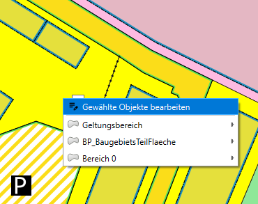
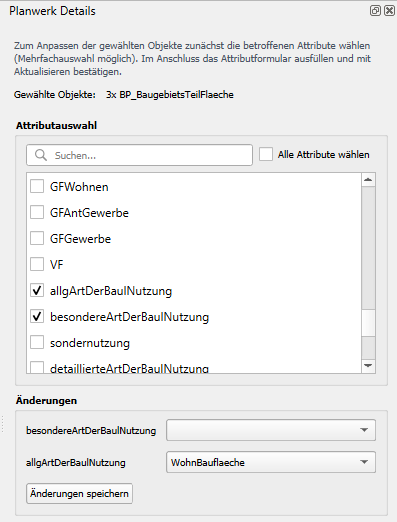
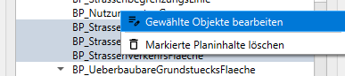

# Mehrfachbearbeitung

Die Mehrfachbearbeitung ist eine Funktion zum Bearbeiten mehrerer Planinhalte eines erfassten Plans von der gleichen
XPlan-Objektart. 

1. [Plan auf Karte anzeigen](elements/plan-details.md#kartenanzeige)
2. Mit den QGIS-Auswahlwerkzeugen eine beliebige Auswahl auf der Karte treffen (bspw. _über Einzelklick wählen_ oder
   _Objekte nach Wert wählen_)
    <figure markdown="span">
        
    </figure>

3. Das Werkzeug **Planinhalte konfigurieren / abfragen** aus der XPlanung-Werkzeugleiste wählen. ++alt+q++
4. Ein beliebiges Objekt in der aktuellen Auswahl auf der Karte mit Rechtsklick wählen und im Kontextmenü die
   Option **Gewählte Objekte bearbeiten** aufrufen
    <figure markdown="span">
        
    </figure>
5. In der Attributauswahl alle Attribute auswählen, die angepasst werden sollen
6. Im Abschnitt _Änderungen_ die neuen Attributwerte eintragen
7. Mit Button _Änderungen speichern_ werden die neuen Attributwerte den gewählten Objekten zugewiesen
    <figure markdown="span">
        
    </figure>

!!! tip

    Alternativ kann die Mehrfachbearbeitung auch über den [Objektbaum](elements/plan-details.md#der-objektbaum) 
    aufgerufen werden. Nach Auswahl mehrerer Einträge gleicher Objektart im Kontextmenü die Option 
    **Gewählte Objekte bearbeiten** aufrufen:
    <figure markdown="span">
        
    </figure>