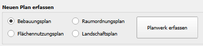
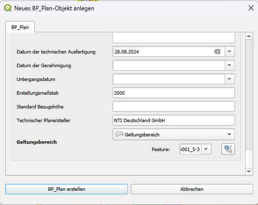

# Neuen Plan erfassen

Voraussetzung für die Erfassung eines neuen Planwerks ist ein Vektorlayer 
vom Geometrietyp (Multi)Polygon, der den Geltungsbereich des zu erfassenden 
Plans beschreibt. Sollte der Plan nur teilvektoriell erfasst werden, wird 
zusätzlich ein georeferenziertes Rasterbild der Planzeichnung benötigt.

1. Im Hauptdialog der Anwendung im Abschnitt **Neuen Plan erfassen** die entsprechende Art des zu erfassenden Plans#
   auswählen

2. Mit dem Button **Planwerk erfassen** öffnet sich ein Sachdatendialog zur Konfiguration der Sachdaten für den zu 
   erstellenden Plan
   
      <figure markdown="span">
       
      </figure>

3. Im Formular alle benötigten Attribute mit Daten füllen. Dabei sind die folgenden Angaben als Pflichtattribute 
   zwingend auszufüllen:

   <table>
      <tr>
          <th>planArt</th>
          <td>Art des Planwerks</td>
      </tr>
      <tr>
         <th>Gemeinde</th>
         <td><tooltip term="datenobjekt">Datenobjekt</tooltip> vom Typ <code>XP_Gemeinde</code>. Entweder bestehendes Objekt im Dropdown wählen oder 
            über das Plus-Symbol ein neues Objekt anlegen.
            Benötigte Daten: <ul>
            <li> Gemeindeschlüssel (12-stellig) oder Regionalschlüssel</li>
            <li> Name der Gemeinde </li>
            </ul>
         </td>
      </tr>
      <tr>
         <th>name</th>
         <td>Beliebiger Bezeichner für den Plan</td>
      </tr>
      <tr>
         <th>Geltungsbereich</th>
         <td>Auswahlmöglichkeit für die Vektorgeometrie des Geltungsbereich. Nach Auswahl des Layers bestehen zwei Optionen:
            <ul>
               <li><b>Kartenabfrage:</b> Über die Schaltfläche mit dem Cursor-Symbol aktiviert sich ein QGIS-Kartenwerkzeug, mit dem der Geltungsbereich auf der Karte gewählt werden kann (Linke Maustaste zum Auswählen eines Features auf der Karte; rechte Maustaste zum Deaktivieren des Werkzeugs)</li>
               <li><b>Auswahl über ID:</b> Anstatt der Nutzung des Werkzeugs, kann auch direkt in der unteren Auswahlliste das Feature gewählt werden, wenn die Nummer des Features bekannt ist.</li>
            </ul>
         </td>
      </tr>
   </table>

<figure markdown="span">
   
</figure>
   
!!! info "Geometrie des Geltungsbereich"

      Die Geomtrie des Geltungsbereichs muss zwingend vom Typ (Multi-) Polygon sein.
      Es wird keine Umring-Geometrie (Linie) akzeptiert.

Weitere Schritte:

- [Planwerk-Details abfragen](#)
- [Vektorielle Planinhalte hinzufügen](add-plancontent.md#planinhalte-mit-raumbezug-hinzufugen)