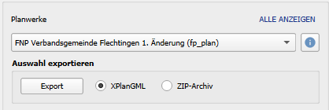

# XPlanGML Export

SAGis XPlanung ermöglicht den Export aller erfassten Planwerke in das Austauschformat XPlanGML. 
Die Anwendung erzeugt dabei XPlanGML-Dateien in der Version 5.3 oder 6.0 
(Anpassung der Version in den [Einstellungen](#) möglich).

1. Planwerk im Dropdown-Menü im untersten Abschnitt des Hauptdialogs auswählen
    
2. Ausgabeformat über die Auswahl der zwei Optionsfelder festgelegen:
    <table>
        <tr>
            <th>XPlanGML</th>
            <td>Beim Export mit der Option XPlanGML wird ausschließlich die XPlanGML-Datei ausgegeben</td>
        </tr>
        <tr>
            <th>ZIP-Archiv</th>
            <td>Bei der Auswahl der Option ZIP-Archiv wird ein komprimierter Ordner samt XPlanGML und allen 
                verknüpften Referenzen ausgegeben
            </td>
        </tr>
    </table>
3. Mit dem Button <b>Export</b> startet der Export
    
!!! info

    Abhängig von der Größe des Planwerks kann dieser Prozess einige Zeit in Anspruch nehmen. 
    Nach Beendigung wird der Erfolg des Exports in der Statusleiste bestätigt.
