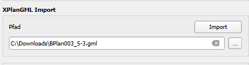

# XPlanGML Import

Neben dem [Export von Planwerken](plan-export.md) erlaubt SAGis XPlanung den Import von bestehenden Planwerken 
im XPlanGML-Format, um ein Planwerk, das bereits XPlanung konform vorliegt, im QGIS zu visualisieren und zu bearbeiten. 

!!! info 

    Ein fehlerfreier Import funktioniert nur für unterstützte XPlanGML-Versionen.
    Andere Versionen des Austauschformats funktionieren möglicherweise abhängig von der Belegung der Attribute auch, 
    jedoch können dann einzelne Informationen beim Import verloren gehen.

1. Zum Import im Abschnitt des Hauptdialogs <b>XPlanGML Import</b> die Schaltfläche mit den drei Punkten wählen.

    

2. Im Dialog den Speicherort der XPlanGML-Datei suchen, anschließend mit Button <b>Öffnen</b> bestätigen
3. Im letzten Schritt die ausgewählte Datei, die im Eingabefeld <b>Pfad</b> erscheint, mit einem Klick auf 
    <b>Import</b> in die Datenbank überführen

!!! info 
    
    Abhängig von der Größe des Planwerks kann dieser Prozess einige Zeit in Anspruch nehmen. 
    Der Import-Fortschritt wird im Dialog angezeigt. Mit dem Abbruch-Icon kann der Import-Prozess vorzeitig abgebrochen 
    werden.
