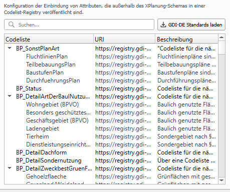

# Codelisten

Die Verwendung von sogennanten Codelisten erlaubt es Informationen im XPlan-Format zu erfassen, die nicht direkt Teil
des Standards sind. Ein Codelist-Attribut ähnelt den Schlüsselnummer-Attributen (Enumerationen), mit dem Unterschied, 
dass die vorgebenen Auswahlwerte in einer externen Codeliste definiert sind. Codelisten werden in der
GDI-DE Registry verwaltet.

Findet sich kein passender Eintrag in der Codeliste oder sind die vorhandenen Werte für den eigenen Datensatz nicht 
spezifisch genug oder unpassend, so kann die Leitstelle XPlanung / XBau kontaktiert werden, um die XPlanung-Codelisten 
um passende Werte zu erweitern. 

- siehe [XLeitstelle: Externe Codelisten](https://xleitstelle.de/Codelisten)

<h4>Codelisten aus GDI-DE Registry abrufen</h4>
- Mit Button **GDI-DE Standards laden** werden die veröffentlichten Codelisten-Einträge aus der Registry abgerufen

<figure markdown="span">
    
</figure>

!!! info

    Nach einmaligem Abruf der Codelisten-Einträge werden diese in der XPlan-gespeichert. Falls Änderungen in der
    Registry veröffentlicht werden, müssen die Daten erneut abgerufen werden um auf entsprechende neue Werte zuzugreifen.

