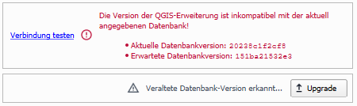

# Datenbank

Die Seite für Datenbank-Einstellungen ist in die folgenden zwei Fenster unterteilt:

=== "Verbindung" 

    ### Verbindungsinformationen

    <table>
        <tr>
            <th>PostGIS Verbindung</th>
            <td>Datenquelle für die XPlan-Daten.</td>
        </tr>
        <tr>
            <th>Nutzername</th>
            <td>Name eines PostgreSQL Nutzers mit Zugriff auf die unter <i>PostGIS Verbindung<i> gewählte Datenbank</td>
        </tr>
        <tr>
            <th>Passwort</th>
            <td>Passwort zur Authentifizierung im Zusammenhang mit dem gewählten Nutzernamen</td>
        </tr>
    </table>
    !!! tip "Verbindungsinformationen"
        
        Falls die Zugangsdaten bereits im QGIS über die PostGIS-Verbindung gespeichert sind, werden die Felder 
        _Nutzername_ und _Passwort_ automatisch übernommen

    ### Verbindungstest

    Mit dem Button *Verbindung testen* wird die Verbindung zur konfigurierten Datenbank geprüft. Bei erflogreicher 
    Verbindung wird die Version der installierten XPlan-Datenbank angezeigt. Sollte die Verbindung
    fehlschlagen wird im Dialog stattdessen eine Fehlermeldung angezeigt. 

    Mögliche Fehlermeldungen:
    <table>
        <tr>
            <th>Inkompatible Datenbankversion</th>
            <td>
                Die Version der installierten QGIS-Erweiterung benötigt eine andere Version der XPlan-Datenbank. 
                Sollte eine veraltete Datenbankversion vorliegen, besteht die Möglichkeit mit dem Button <b>Upgrade</b>
                die Datenbank auf den aktuellen Stand zu bringen.
                <figure>
                    
                </figure>
            </td>
        </tr>
        <tr>
            <th>fehlerhafter Nutzername/Passwort</th>
            <td>Die angegebene Kombination aus Benutzernamen und Passwort hat keinen Zugriff auf die Datenbank</td>
        </tr>
        <tr>
            <th>keine XPlan-Datenbank</th>
            <td>Die angegebene PostGIS-Verbindung verweist nicht auf eine Datenbank, die dem XPlanung-Schema folgt</td>
        </tr>
    </table>    

=== "Neue Datenbank anlegen"

    Über die Seite _Neue Datenbank anlegen_ kann eine neue (leere) XPlan-Datenbank angelegt werden. Dieser Prozess ist
    auf der Seite [Einrichtung einer Datenquelle](../setup/database-setup.md) beschrieben.