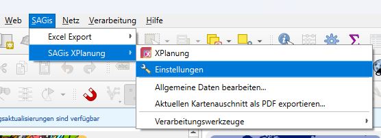

# Einstellungen

In den Einstellungen kann das Verhalten der Anwendung konfiguriert werden. 

  <h4>Öffnen der Einstellungen</h4>
  - In der QGIS-Menüleiste den Menüpunkt **SAGis | SAGis XPlanung | Einstellungen** aufrufen
    <figure markdown="span">
      
    </figure>

!!! warning 

    Einstellungen werden im lokalen Benutzerverzeichnis gespeichert und damit nicht bei Anmeldung mit anderem Nutzer 
    übernommen. Alle Einstellungen sind QGIS-Profil übergreifend, d.h. bei Wechsel des QGIS Profils werden die gleichen
    Einstellungen des SAGis XPlanung übernommen.
