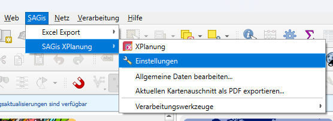

# Einstellungen

In den Einstellungen kann das Verhalten der Anwendung konfiguriert werden. 

  <h4>Öffnen der Einstellungen</h4>
  - In der QGIS-Menüleiste den Menüpunkt **SAGis | SAGis XPlanung | Einstellungen** aufrufen
    <figure markdown="span">
      
    </figure>

!!! warning 

    Einstellungen werden im lokalen Benutzerverzeichnis gespeichert und damit nicht bei Anmeldung mit anderem Nutzer 
    übernommen. Alle Einstellungen sind QGIS-Profil übergreifend, d.h. bei Wechsel des QGIS Profils werden die gleichen
    Einstellungen des SAGis XPlanung übernommen.

## Allgemeine Einstellungen

Auf der Startseite der Einstellungen lassen sich die folgenden allgemeinen Einstellungen treffen:

### Exportoptionen

<table>
    <tr>
        <th>Pfad für externe Referenzen</th>
        <td>Beim <a href="../../plan-export">XPlanGML-Export</a> als ZIP-Archiv werden alle Externen Referenzen im angegebenen 
            Unterordner gespeichert. Mit Option <i>Referenzen im Hauptordner speichern</i> werden alle Referenzen auf gleicher
            Ebene mit der XPlanGML-Datei verpackt</td>
    </tr>
    <tr>
        <th>XPlanung-Version</th>
        <td>Auswahlliste zum Wechseln der XPlanung-Version. Die festgelegte XPlanung-Version beeinflusst alle 
            verfügbaren Objektklassen, Attribute und Auswahllisten in der Anwendung  
            

                
Info

                
Beim Wechsel der Version werden keine Daten aus der Datenbank entfernt. Es findet jedoch keine
                    Migration statt.

            

        </td>
    </tr>

</table>

### Validierung

<table markdown="span">
    <tr>
        <th>Geometrien automatisch bereinigen</th>
        <td markdown="span">Zum Erfüllen der <a href="../../elements/plan-details#geometrieprufung">Geometrieprüfung</a> kann SAGis
            XPlanung zwei Fehlerquellen bei der Datenerfassung automatisch korrigieren. Dies betrifft den _korrekten 
            Umlaufsinn von Polygongeometrien_ und die Erfassung von _doppelten Stützpunkten_.   
            Wenn die Option <i>Geometrien automatisch bereinigen</i> aktiviert ist, werden alle Geometrien, die neu in 
            der Datenbank erfasst werden automatisch korrigiert. Dieser Prozess kann durch die folgenden Optionen 
            konfiguriert werden:
            <ul>
                <li>
                    Topologie erhalten: Die Geometriebereinigung erhält die topologische Struktur der Geometrien. Es 
                    werden nur doppelte, aufeinanderfolgende Stützpunkte entfernt.
                </li>
                <li>
                    bessere Erkennung doppelter Stützpunkte: Die Geometriebereinigung entfernt auch doppelte Stützpunkte, 
                    die nicht aufeinanderfolgend sind. Dies kann jedoch zu Änderungen in der Topologie führen. 
                </li>
            </ul>
        </td>
    </tr>
</table>