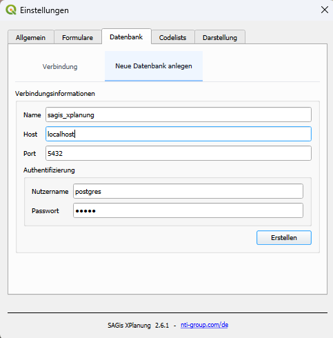
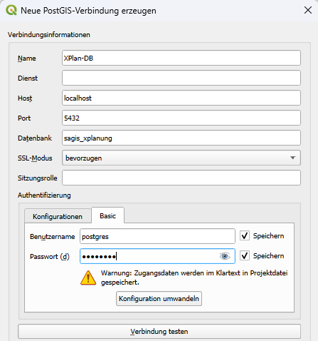

# Einrichtung einer Datenquelle

=== "Neue Standard Datenquelle"

    !!! tip "Neu in Version 2.0.1"

    1. Einstellungen aufrufen: <b>SAGis | SAGis XPlanung | Einstellungen</b>
    2. Seite <b>Datenbank</b> aufrufen
    3. Option <b>Neue Datenbank anlegen</b> wählen
    4. Verbindungsinformation eintragen:
        <table>
            <tr>
                <th>Name</th>
                <td>Beliebiger Name der zu erstellenden Datenbank</td>
            </tr>
            <tr>
                <th>Host</th>
                <td>Host-Adresse des PostgreSQL Server</td>
            </tr>
            <tr>
                <th>Port</th>
                <td>Der TCP Port des PostgreSQL Server</td>
            </tr>
            <tr>
                <th>Nutzername</th>
                <td>Name eines PostgreSQL Nutzers mit Berechtigung zum Erstellen neuer Datenbanken und Tabellen</td>
            </tr>
            <tr>
                <th>Passwort</th>
                <td>Passwort zur Authentifizierung im Zusammenhang mit dem gewählten Nutzernamen</td>
            </tr>
        </table>
        <figure markdown="span">
            
        </figure>
    5. Mit Button <b>Erstellen</b> die neue Datenbank erstellen
    6. Nach erfolgreichem Erstellen der Datenbank mit Button <b>Konfiguration anwenden</b> die neue Datenbank als aktuelle Datenquelle festlegen

=== "Manuelle Konfiguration"

    

    <h4>Neue XPlan Datenbank anlegen</h4>

    !!! info

        Falls bereits eine XPlan-Datenbank besteht, kann dieser Schritt übersprungen werden

    1. Im PostgreSQL eine neue Datenbank anlegen, beispielsweise mit pgAdmin
    2. SQL-Skript (<b>create_&lt;version&gt;.sql</b>) zum Erzeugen des XPlan-Schemas in der Datenbank ausführen
    

    

    <h4>Neue PostgreSQL Verbindung anlegen</h4>

    1. Im QGIS Bedienfeld **Browser** das Kontextmenü auf dem Menüpunkt **PostgreSQL** öffnen (rechte Maustaste)
    2. **Neue Verbindung** aufrufen
    3. Verbindungsinformationen der im Schritt zuvor angelegten Datenbank eintragen:
        <figure markdown="span">
            
        </figure>
    

    

    <h4>Neue Datenquelle anlegen (SAGis XPlanung)</h4>

    1. Einstellungen aufrufen: **SAGis | SAGis XPlanung | Einstellungen**
    2. Seite **Datenbank** aufrufen
    3. Option **Verbindung** wählen
    4. In der Auswahlliste PostGIS Verbindung die neu angelegte Verbindung wählen
    5. Die Felder Nutzername und Passwort füllen, falls diese Information nicht in den QGIS-Optionen gesetzt wurde
    
