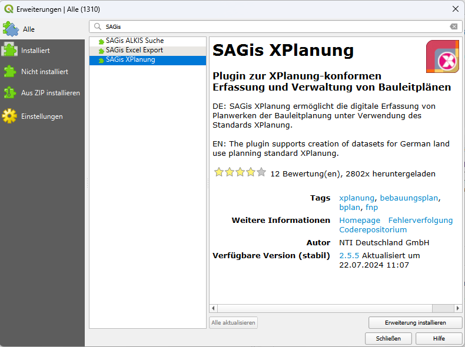
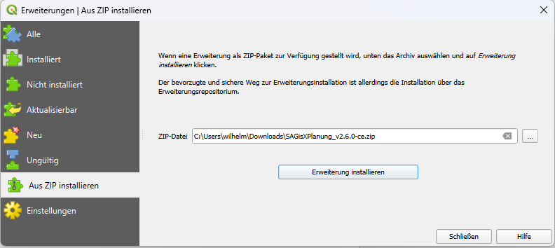

# Installation des QGIS Plugins

## Installation aus QGIS Plugin Repository

Community-Version

1. Erweiterungsmanager aufrufen: **Erweiterungen | Erweiterungen verwalten und installieren…**
2. Option **Alle** in der Seitenleiste wählen
3. Im Suchfeld nach **SAGis** suchen und den Eintrag **SAGis XPlanung** wählen
4. **Erweiterung installieren**
    <figure markdown="span">
     
    </figure>

## Installation über Plugin-Datei

Vollversion

1. Erweiterungsmanager aufrufen: **Erweiterungen | Erweiterungen verwalten und installieren…**
2. Option **Aus ZIP installieren** in der Seitenleiste wählen</step>
3. Dateipfad zum Archiv der Anwendung auswählen (SAGis.XPlanung_&lt;version&gt;.zip)
4. **Erweiterung installieren**
    <figure markdown="span">
     
    </figure>
