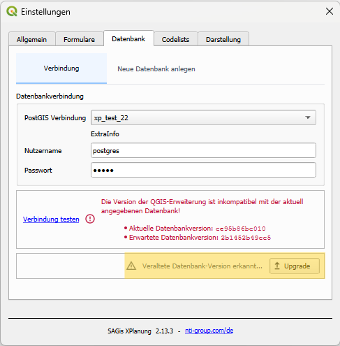

# Update einer bestehenden Installation

!!! warning "Wichtiger Hinweis für Kunden der Vollversion"
    Updates der Vollversion dürfen **nicht** über das offizielle QGIS Plugin Repository installiert werden, da dabei 
    die bestehende Lizenz durch die Community-Version überschireben wird. Die Installation/Update erfolgt 
    ausschließlich über eine von NTI bereitgestellte Plugin-Datei.
    Sollten Sie dennoch versehentlich ein Update ausgeführt haben, [kontaktieren](../general/support.md) Sie uns.


!!! warning "Backup empfohlen"
    Vor der Durchführung eines Updates empfehlen wir ausdrücklich die Erstellung eines vollständigen Backups der XPlan-Datenbank.


---

## Plugin-Update installieren
<div><span class="full-label">Vollversion</span></div>

Nach Bereitstellung eines Updates erhalten Sie eine E-Mail mit einem Downloadlink zur aktuellen Plugin-Version als ZIP-Datei.

### Installation des Updates

1. ZIP-Datei des Plugins über den Freigabelink herunterladen
2. QGIS öffnen
3. Erweiterungsmanager öffnen:

    ```text
    Erweiterungen → Erweiterungen verwalten und installieren
    ```

4. Zum Tab **„Aus ZIP installieren“** wechseln
5. Heruntergeladene ZIP-Datei auswählen
6. Installation starten

Ein vorheriges Entfernen der bestehenden Plugin-Version ist nicht erforderlich. Alle Einstellungen, Konfigurationen und Daten bleiben erhalten.

!!! info
    Während der Installation können [zusätzliche Software-Bibliotheken](../general/FAQ.md#python-pakete) aktualisiert werden. Entsprechende Dialoge bitte mit **„Ja“** bestätigen.

Nach Abschluss der Installation muss QGIS einmal neu gestartet werden, damit das Update vollständig angewendet wird.

---

## Aktualisierung der Datenbankstrukturen

Bei Updates zwischen zwei verschiedenen Haupt- oder Nebenversionen ist zusätzlich eine Aktualisierung der Datenbankstrukturen erforderlich.

Beispiel:

- Update von `2.12.x` → `2.13.x` → **Datenbank-Upgrade erforderlich**
- Update von `1.10.x` → `2.0.x` → **Datenbank-Upgrade erforderlich**
- Update von `2.13.1` → `2.13.2` → **kein Datenbank-Upgrade erforderlich**

Grundsätzlich gilt:

> Plugin-Versionen mit unterschiedlichen Nebenversionen können nicht auf derselben Datenbankstruktur arbeiten.

---

## Datenbank-Upgrade durchführen

Nach dem Plugin-Update und dem Neustart von QGIS kann das Datenbank-Upgrade direkt innerhalb von SAGis XPlanung durchgeführt werden.

### Vorgehensweise

1. Einstellungen von SAGis XPlanung öffnen
2. Zum Tab **„Datenbank“** wechseln
3. Button **„Upgrade“** auswählen



Das Upgrade führt die erforderlichen SQL-Skripte automatisch im Hintergrund aus.

!!! warning
    Der konfigurierte Datenbankbenutzer benötigt Berechtigungen zum Erstellen und Ändern von Tabellen und Datenbankstrukturen.

    Neu angelegte Datenbankobjekte (z. B. Tabellen oder Sequenzen) werden standardmäßig dem ausführenden PostgreSQL-Benutzer als Owner zugewiesen. Dies sollte insbesondere bei Datenbankumgebungen mit rollenbasierten Berechtigungs- und Ownership-Konzepten berücksichtigt werden.

<details>
<summary>Alternativ: Upgrade über DB-Administration</summary>
Falls kein geeigneter Datenbankbenutzer innerhalb von QGIS verfügbar ist, kann das Upgrade alternativ auch direkt durch 
einen Datenbankadministrator durchgeführt werden. Hierfür stellen wir auf Anfrage das benötigte SQL-Upgrade-Skript 
separat zur Verfügung. Die Ausführung kann anschließend über PostgreSQL-Administrationswerkzeuge, wie 
pgAdmin, DBeaver, ... erfolgen.

</details>

---

## Community-Version

Nutzer der Community-Version erhalten Updates weiterhin direkt über das QGIS Plugin Repository.
